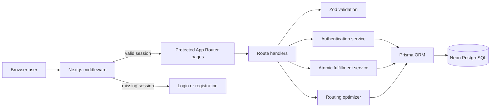
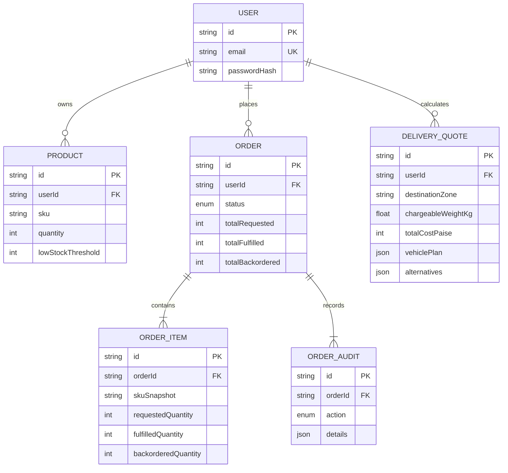
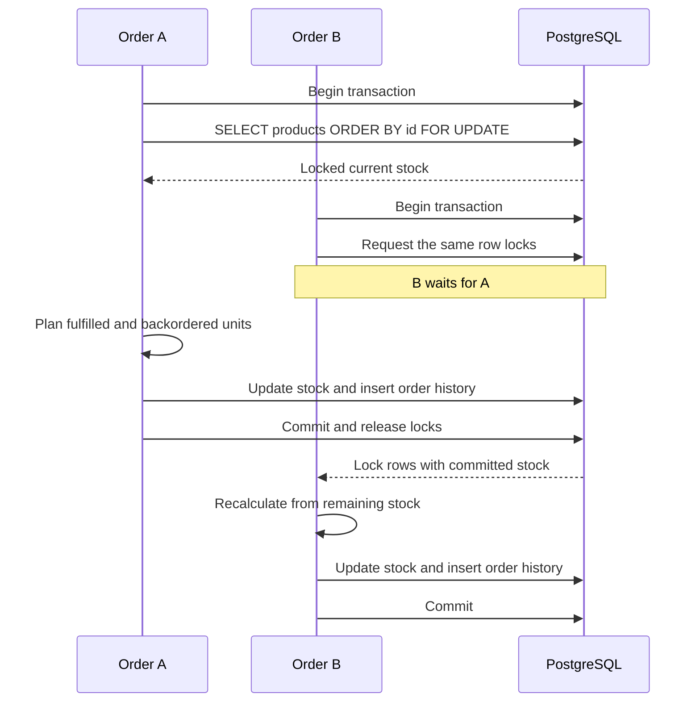
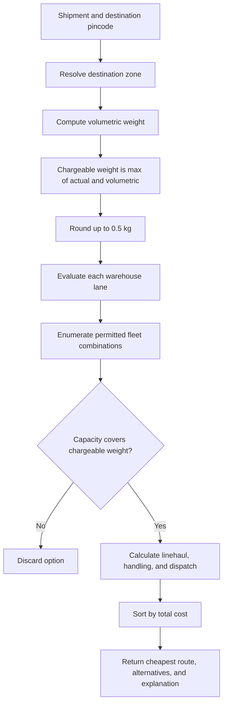

# Stockroom

### Tier 3 warehouse inventory, fulfillment, and delivery routing

[](https://github.com/Ishanb747/focus/actions/workflows/ci.yml)


Stockroom is a full-stack submission for all three tiers of the developer assessment. It combines real authentication, user-scoped inventory CRUD, concurrency-safe partial order fulfillment, and a capacity-aware rate and routing optimizer.

## Reviewer quick start

```bash
cp .env.example .env
# Add a PostgreSQL connection and a random JWT secret of at least 32 characters.
pnpm install
pnpm db:push
pnpm db:seed
pnpm dev
```

Open [http://localhost:3000](http://localhost:3000) and sign in with:

- Email: `demo@stockroom.app`
- Password: `Demo1234`

Then review these workflows in order:

1. `/dashboard` - inventory CRUD, validation, search, and low-stock states.
2. `/orders` - multi-SKU fulfillment, backorders, totals, and audit events.
3. `/routing` - dimensional billing, fleet splitting, route comparison, and quote history.

For a criterion-by-criterion review, see [docs/ASSESSMENT.md](docs/ASSESSMENT.md). For production setup, see [docs/DEPLOYMENT.md](docs/DEPLOYMENT.md).

## Assessment coverage

| Tier | Requirement | Implementation |
| --- | --- | --- |
| 1 - Foundation | Real signup/signin, protected routes | bcrypt password hashes, signed HTTP-only JWT cookie, middleware and server guards |
| 1 - Foundation | Product CRUD and low-stock dashboard | User-scoped APIs, Zod validation, responsive inventory workspace |
| 2 - Logic | Multiple SKUs and varying quantities | Typed order lines with normalized, unique SKUs |
| 2 - Logic | Atomic stock deduction | One PostgreSQL transaction with stable `FOR UPDATE` row locking |
| 2 - Logic | Partial fulfillment and history | Fulfilled/backordered quantities, immutable item snapshots, chronological audits |
| 3 - Hard | Pincode zones and rate matrix | Six destination zones, five warehouse hubs, explicit symmetric lane matrix |
| 3 - Hard | Volumetric weight | `max(actual, L × W × H / 5000)`, rounded up to 0.5 kg |
| 3 - Hard | Vehicle capacity and splitting | Exhaustive finite-fleet combination search across three vehicle types |
| 3 - Hard | Cheapest viable route | Ranked warehouse options, cost breakdown, deterministic tie-breaks, justification |

## System architecture



The browser never receives password hashes, database credentials, or the signing secret. Every mutation derives ownership from the verified session rather than accepting a user ID from the client.

## Data model



## Concurrency-safe fulfillment

The fulfillment plan is calculated only after the requested product rows are locked. Stock updates, the order, item snapshots, and audit events commit together.



This prevents lost updates and overselling at `READ COMMITTED`. Locks are acquired in stable product-ID order to reduce deadlock risk. Unknown SKUs throw inside the transaction, so no stock or history is written.

Order states:

- `FULFILLED` - every requested unit was available.
- `PARTIALLY_FULFILLED` - some units were deducted and the remainder was backordered.
- `BACKORDERED` - none of the requested units were available.

## Rate and routing engine



### Routing assumptions

- Warehouse hubs: Delhi, Mumbai, Chennai, Kolkata, and Guwahati.
- Zones: `NORTH`, `WEST`, `SOUTH`, `EAST`, `NORTHEAST`, and `REMOTE`.
- Measurements: centimetres and kilograms.
- Volumetric divisor: `5,000`.
- Billing increment: `0.5 kg` rounded upward.
- Cost: chargeable weight × lane rate + warehouse handling + vehicle dispatch.
- Fleet: finite mini vans, box trucks, and heavy trucks per warehouse.
- Money: calculated and persisted as integer paise.
- Equal totals prefer fewer vehicles, then less unused capacity, then stable warehouse ID order.

The optimizer treats configured fleet counts as deterministic quote-time availability. Transactional vehicle reservation, service levels, and SKU-level warehouse placement are intentionally outside this assessment scope.

## Verification

### Fast checks

```bash
pnpm test
pnpm lint
pnpm build
```

### Live PostgreSQL checks

```bash
pnpm verify:orders
pnpm verify:concurrency
pnpm verify:routing
```

| Command | Evidence |
| --- | --- |
| `pnpm test` | Validation, fulfillment math, pincode mapping, matrix symmetry, dimensional billing, fleet optimization |
| `pnpm verify:orders` | Partial fills, zero stock, unknown-SKU rollback, totals, and audit persistence |
| `pnpm verify:concurrency` | Two simultaneous orders cannot fulfill more than starting stock |
| `pnpm verify:routing` | Actual and volumetric billing, route choice, vehicle splitting, persistence, unroutable rejection |
| `pnpm build` | Strict TypeScript and optimized production compilation |

Integration scripts create isolated temporary users, assert persisted database state, and remove their test data in `finally` blocks.

## API surface

| Method | Route | Purpose |
| --- | --- | --- |
| `POST` | `/api/auth/register` | Create an account and session |
| `POST` | `/api/auth/login` | Verify credentials and create a session |
| `POST` | `/api/auth/logout` | Clear the session cookie |
| `GET`, `POST` | `/api/products` | List or create user-owned inventory |
| `PUT`, `DELETE` | `/api/products/:id` | Update or remove a user-owned product |
| `GET`, `POST` | `/api/orders` | List history or atomically fulfill an order |
| `GET`, `POST` | `/api/rates` | List or calculate persistent delivery quotes |

All product, order, and quote routes require authentication. Validation failures return `400`, missing authentication returns `401`, domain conflicts use `409` or `422`, and unexpected failures return a non-sensitive `500` response.

## Technology

- Next.js 14 App Router and React 18
- Strict TypeScript
- Prisma ORM and PostgreSQL
- bcrypt password hashing
- `jose` JWT signing and verification
- Zod validation on client and server
- Vitest unit tests
- Plain responsive CSS with no component framework

## Environment

| Variable | Required | Description |
| --- | --- | --- |
| `DATABASE_URL` | Yes | PostgreSQL URL with TLS enabled in production |
| `JWT_SECRET` | Yes | Random signing secret, at least 32 characters |

Never commit `.env`. The tracked `.env.example` contains placeholders only.

## Security decisions

- bcrypt cost factor 12 and a 72-character password ceiling.
- Generic login failure messages prevent account enumeration.
- Signed, HTTP-only, same-site session cookie; `Secure` is enabled in production.
- Seven-day session expiry and explicit logout.
- Middleware protection plus server-side session checks on protected pages and APIs.
- Product mutations include both product ID and session user ID in authorization filters.
- Quote and order history queries are always scoped to the session user.
- Zod bounds quantities, measurements, line counts, pincode format, and allowed SKU characters.
- No secrets, hashes, or internal stack traces are returned to the browser.

## Repository structure

```text
.github/workflows/ci.yml  Automated tests, lint, and production build
docs/                     Assessment evidence and deployment runbook
prisma/                   PostgreSQL schema and deterministic demo seed
scripts/                  Live-database verification harnesses
src/app/api/              Auth, inventory, order, and rate endpoints
src/app/dashboard/        Protected inventory workspace
src/app/orders/           Protected fulfillment workspace
src/app/routing/          Protected routing workspace
src/components/           Client workflows and shared navigation
src/lib/                  Auth, validation, fulfillment, and routing domain logic
src/middleware.ts         Early page protection and auth redirects
```

## Trade-offs and next steps

- Add password reset, email verification, session revocation, and rate limiting.
- Run browser automation and database integration tests against isolated CI databases.
- Add pagination and automatic backorder release after replenishment.
- Reserve warehouse inventory and fleet capacity in one transactional allocation workflow.
- Version carrier matrices and incorporate service levels, delivery time, and live fleet telemetry.

The pure planners, persistent snapshots, stable tie-breaks, and explicit assumptions keep those extensions possible without rewriting the current workflows.
